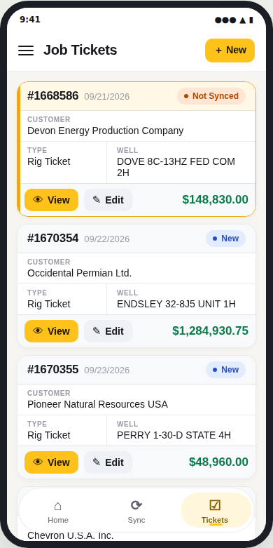
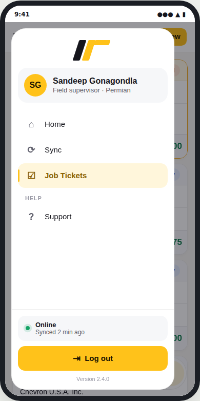
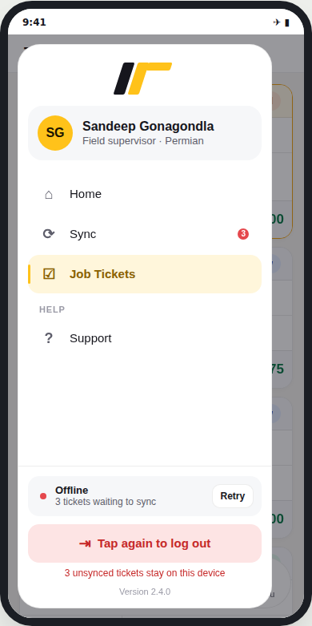
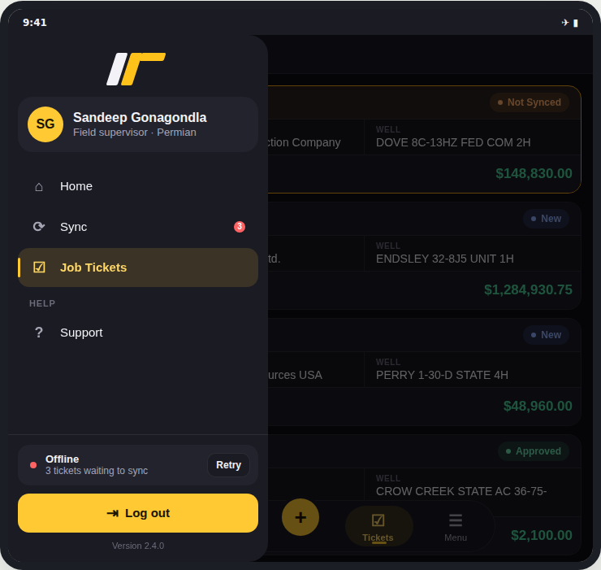

# react-native-app-nav

App navigation for field apps: a floating **island tab bar** and an overlay **navigation drawer**. Built in the same style as [`react-native-multiselect`](../react-native-multiselect) and [`react-native-record-card`](../react-native-record-card).

| Tab bar | Drawer | Offline, logout armed | Tablet, dark, edge style |
|---|---|---|---|
|  |  |  |  |

Pure React Native (`Animated`, `PanResponder`, `Modal`). No Expo, no Reanimated, no Gesture Handler, no React Navigation requirement and no icon font.

## `IslandTabBar`

| | |
|---|---|
| **Floating island** | A rounded pill that floats above the content with a soft shadow. On tablets it stays compact and centred (`maxWidth`, default 480) instead of stretching edge to edge. |
| **Sliding highlight** | A soft accent pill with a small accent bar springs to the active tab. Icons bounce slightly when tapped. |
| **Badges** | `badge: 3` shows a red count (`99+` above 99); `badge: true` shows a dot. Screen readers hear "Sync, 3 new". |
| **Main action** | `action={{ label: 'New ticket', onPress }}` adds a raised round `+` button in the middle, in thumb reach. Use it with an even number of tabs. |
| **Labels** | `labels="always"` (default) or `"active"` to label only the active tab. |
| **Reselect** | `onReselect` fires when the active tab is tapped again, e.g. to scroll its list to the top. |
| **Hide on scroll** | `useHideOnScroll()` returns `{ hidden, onScroll }`. The bar slides away while you scroll down and comes back on any upward scroll or at the top. |

## `NavDrawer`

| | |
|---|---|
| **Island or edge** | `variant="island"` (default) floats a rounded panel with a margin around it; `"edge"` attaches it to the screen edge. `side="left"` or `"right"`. |
| **Profile header** | Your logo, then the user's avatar (initials by default), name and role. |
| **Items** | An active item gets a soft accent pill and accent bar. Badges, optional one-line hints (`description`), and section headings (`section`). |
| **Selection** | `onSelect` runs immediately and the drawer closes while the new screen renders behind the dimmed backdrop, so navigation feels instant. |
| **Sync status** | `status={{ online, detail, action }}` shows a pulsing green dot when online ("Synced 2 min ago"), or a red dot and a button such as Retry when offline ("3 tickets waiting to sync"). |
| **Safe logout** | `onLogout` adds a Log out button that needs a second tap within 3 s. `logoutWarning` explains what happens, e.g. "3 unsynced tickets stay on this device". |
| **Gestures** | Swipe the panel toward its edge, tap the backdrop, or press Android back to close. Items slide in one after another when it opens. |

Both components follow the system light/dark setting, take `topInset`/`bottomInset` from `react-native-safe-area-context`, and accept `theme` overrides.

## Usage

```tsx
import { IslandTabBar, NavDrawer, useHideOnScroll, type NavItem } from './react-native-app-nav/src';
import Icon from 'react-native-vector-icons/MaterialIcons';

type Screen = 'home' | 'sync' | 'tickets' | 'support';

const tabs: NavItem<Screen>[] = [
  { key: 'home', label: 'Home', icon: ({ color, size }) => <Icon name="home" color={color} size={size} /> },
  { key: 'sync', label: 'Sync', badge: pending, icon: ({ color, size }) => <Icon name="sync" color={color} size={size} /> },
  { key: 'tickets', label: 'Tickets', icon: ({ color, size }) => <Icon name="assignment-turned-in" color={color} size={size} /> },
];

const { hidden, onScroll } = useHideOnScroll();

<FlatList onScroll={onScroll} scrollEventThrottle={16} … />

<IslandTabBar
  items={tabs}
  activeKey={screen}
  onChange={setScreen}
  hidden={hidden}
  bottomInset={insets.bottom}
/>

<NavDrawer
  visible={drawerOpen}
  onClose={() => setDrawerOpen(false)}
  items={[...tabs, { key: 'support', label: 'Support', section: 'Help', icon: … }]}
  activeKey={screen}
  onSelect={setScreen}
  profile={{ name: 'Sandeep Gonagondla', subtitle: 'Field supervisor', logo: <Logo /> }}
  status={online ? { online: true, detail: 'Synced 2 min ago' } : { online: false, detail: '3 tickets waiting to sync', action: { label: 'Retry', onPress: sync } }}
  onLogout={logout}
  logoutWarning={pending ? `${pending} unsynced tickets stay on this device` : undefined}
  footnote="Version 2.4.0"
  topInset={insets.top}
  bottomInset={insets.bottom}
/>;
```

Icons can be a glyph string or a render function that receives the state colour, so vector icons tint with the active state. `activeIcon` sets a separate (e.g. filled) icon for the active state.

### With React Navigation

Use the tab bar as a custom `tabBar`:

```tsx
<Tab.Navigator tabBar={({ state, navigation }) => (
  <IslandTabBar
    items={tabs}
    activeKey={state.routes[state.index].name as Screen}
    onChange={key => navigation.navigate(key)}
  />
)}>
```

## Run the demo on a phone

```sh
./scripts/create-demo-app.sh            # creates ../AppNavDemo (bare React Native, no Expo)
cd ../AppNavDemo
npx react-native run-android
```

## Props

### `IslandTabBar`

`items`, `activeKey`, `onChange`, `onReselect?`, `labels?` (`'always' | 'active'`), `action?` (`{ label, icon?, onPress }`), `hidden?`, `bottomInset?`, `floating?` (default `true`; `false` renders in place), `maxWidth?` (480), `theme?`, `style?`.

### `NavDrawer`

`visible`, `onClose`, `items`, `activeKey`, `onSelect`, `profile?` (`{ name, subtitle?, avatar?, logo? }`), `status?` (`{ online, label?, detail?, action? }`), `onLogout?`, `logoutLabel?`, `logoutWarning?`, `logoutIcon?` (render function, like item icons), `footnote?`, `side?`, `variant?`, `width?` (320, capped at 86% of the screen), `topInset?`, `bottomInset?`, `theme?`.

### `NavItem`

`key`, `label`, `icon?`, `activeIcon?`, `badge?` (`number | boolean`), `section?` and `description?` (drawer only), `disabled?`.

## Development

```sh
npm install
npm run typecheck
```
