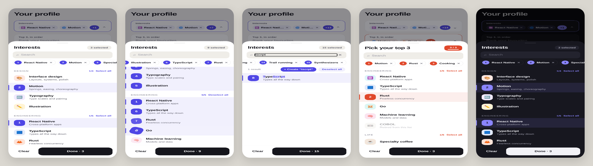

# react-native-multiselect

A bottom-sheet multi-select for React Native that is built around how people actually pick things from a long list.



Pure React Native (`Animated`, `PanResponder`, `FlatList`, `Modal`). No Expo, no Reanimated, no Gesture Handler, no native modules, so it drops into any bare React Native app without linking or pod installs.

## What makes it different

| | |
|---|---|
| **Drag-to-paint selection** | Long-press a row, then drag. Every row between the anchor and your finger takes the anchor's new state. Dragging back un-paints. Starting on a selected row deselects instead. Hold near the top or bottom edge and the list auto-scrolls, so selecting 30 items is one gesture. Disabled rows are skipped. |
| **Ranked picks** | A row's leading tile flips from its icon into a badge with the *order* it was picked (1, 2, 3…). Selection order is preserved in `value`, so "rank your top 3" needs no extra UI. |
| **Selection tray** | A fixed-height strip of numbered chips under the search box. Tap a chip to scroll the list to that option; × removes it. Its height never changes, so the list never jumps under a dragging finger. |
| **Fuzzy search with highlights** | `tscrpt` finds **T**ype**Scr**i**pt**, and matched characters are highlighted. Results are ranked (substring and word-start hits first). Descriptions are searched too. One tap selects or deselects all results. |
| **Grouped sections** | Options with a `group` get a header with a live `3/5` counter and Select all / Deselect all. |
| **Clear with undo** | Clearing shows a toast with **UNDO** for 4 seconds, so there is no confirmation dialog and nothing is lost. |
| **Max limit that explains itself** | With `max`, the counter becomes `2 / 3` with a progress meter. It turns solid at the limit and shakes if you try to go past it (`onLimitReached` lets you add haptics). |
| **Creatable** | Pass `onCreateOption` and a search with no exact match offers **+ Create "query"**. |
| **Compact trigger** | The closed field shows the first chips plus a `+N` counter. Chips can be removed in place without opening the sheet. |

Also included: a spring-driven sheet you can drag down to dismiss, a backdrop that fades with the drag, light and dark themes that follow the system, a themeable accent, keyboard avoidance, and screen reader support (checkbox roles and states, hints, and custom "Remove X" actions).

## Run the demo on a phone

From this folder, run:

```sh
./scripts/create-demo-app.sh            # creates ../MultiSelectDemo (bare React Native, no Expo)
cd ../MultiSelectDemo
npx react-native run-android            # Android device (USB debugging on) or emulator
# macOS only:
(cd ios && bundle install && bundle exec pod install) && npx react-native run-ios
```

The script creates a new app with the React Native CLI, copies `src/` into it, and sets `example/App.tsx` as its home screen. You need the standard React Native environment for your platform (Node, JDK 17 and the Android SDK, or Xcode). See the React Native docs under "Set up your environment".

## Usage

```tsx
import { MultiSelect, type MultiSelectOption } from './react-native-multiselect/src';

const options: MultiSelectOption[] = [
  { value: 'rn', label: 'React Native', description: 'Cross-platform apps', group: 'Engineering', icon: '⚛️' },
  { value: 'ts', label: 'TypeScript', group: 'Engineering', icon: '🟦' },
  { value: 'coffee', label: 'Specialty coffee', group: 'Life', icon: '☕️' },
];

function Profile() {
  const [value, setValue] = useState<string[]>([]);
  return (
    <MultiSelect
      label="Interests"
      placeholder="What are you into?"
      options={options}
      value={value}
      onChange={setValue}
    />
  );
}
```

See [`example/App.tsx`](example/App.tsx) for a full screen that includes a creatable list and a ranked "top 3" picker with a custom accent.

## Props

| Prop | Type | Default | |
|---|---|---|---|
| `options` | `MultiSelectOption<V>[]` | — | `{ value, label, description?, group?, icon?, tint?, disabled? }` |
| `value` | `V[]` | — | Selected values, **in pick order**. Controlled. |
| `onChange` | `(value: V[]) => void` | — | Called on every change. Changes apply live; *Done* just closes the sheet. |
| `label` | `string` | — | Field label, and the sheet title by default. |
| `title` | `string` | `label` | Sheet title. |
| `placeholder` | `string` | `'Select…'` | |
| `searchPlaceholder` | `string` | `'Search'` | |
| `max` | `number` | — | Selection limit. |
| `maxTriggerChips` | `number` | `2` | Chips shown in the closed field before `+N`. |
| `onCreateOption` | `(label) => MultiSelectOption<V> \| undefined` | — | Enables *Create*. Add the returned option to `options` yourself. |
| `onLimitReached` | `() => void` | — | For haptics or analytics. |
| `theme` | `Partial<MultiSelectTheme>` | light/dark | Override any token (`accent`, `accentSoft`, `highlight`, `radius`, …). |
| `disabled` | `boolean` | `false` | |
| `style` | `ViewStyle` | — | Wrapper style. |

`V` is `string | number`.

## Notes

- **Requirements:** React 18+ and React Native 0.72+ (uses `gap`, `userSelect` and `useDeferredValue`). Type-checked against React Native 0.81 and 0.87, and bundles with Metro for Android and iOS. The example also uses `react-native-safe-area-context`, which new React Native apps already include; the component itself has no dependencies.
- **Performance:** rows have fixed heights (`getItemLayout`), all animations use the native driver, and filtering runs on a deferred query so typing stays responsive.
- **Paint gesture:** implemented with the core responder system. The list stops scrolling while a paint is in progress and resumes when you lift your finger.

## Development

```sh
npm install
npm run typecheck
```
