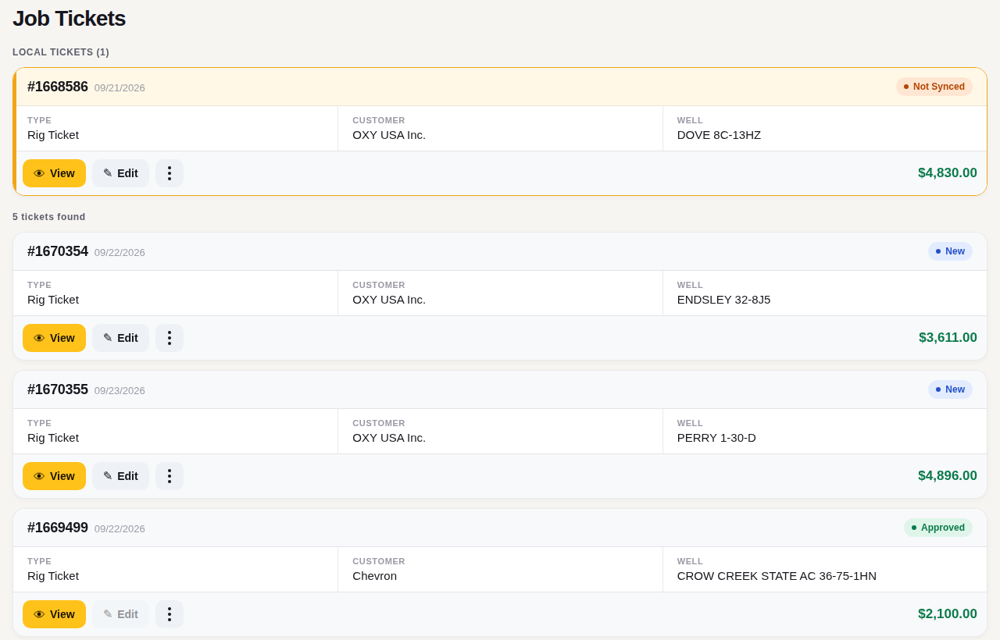
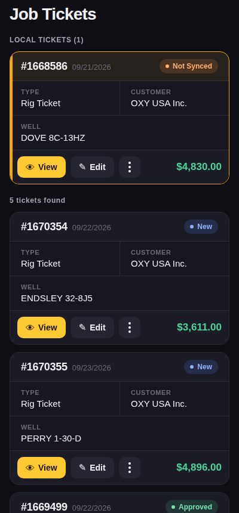
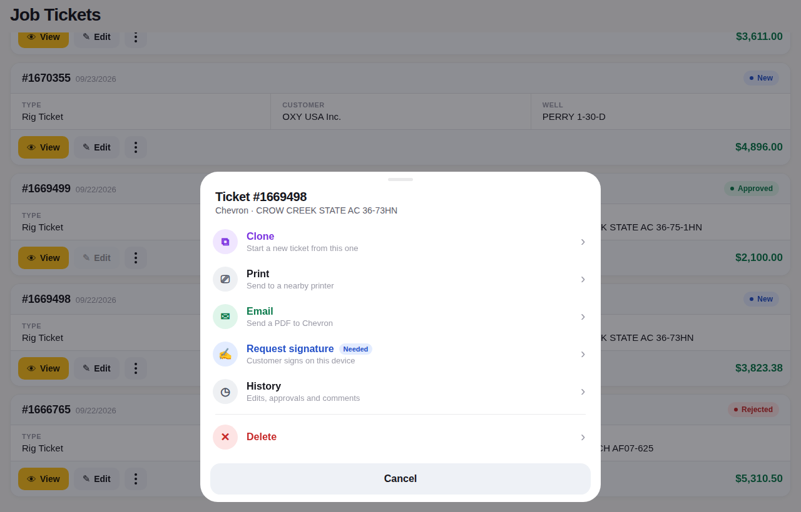
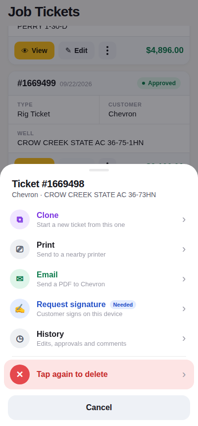
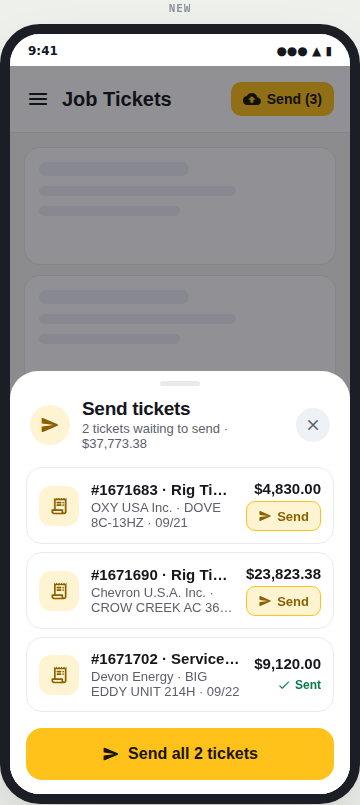
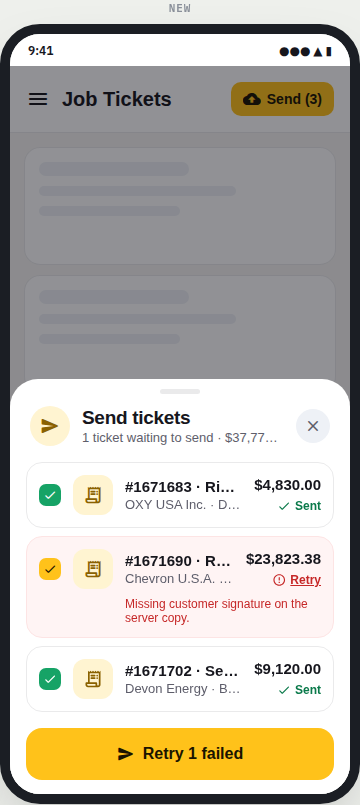
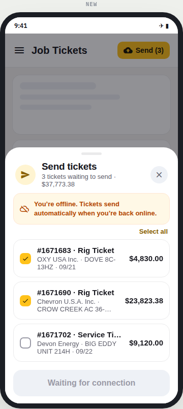

# react-native-record-card

A list card for records such as tickets, orders and jobs, plus a bottom-sheet action menu for its ⋮ button. It is built in the same style as [`react-native-multiselect`](../react-native-multiselect).

| Tablet | Phone (dark) |
|---|---|
|  |  |
|  |  |

Pure React Native (`Animated`, `PanResponder`, `Modal`). No Expo, no Reanimated, no Gesture Handler, no native modules, and no icon font: icons are any string or element you pass.

## What you get

| | |
|---|---|
| **Header with status** | Title (`#1670354`) and a muted subtitle (the date), with a status pill on the right. The pill has a dot and a colour from its tone: `info` for New, `success` for Approved, `warning` for Not Synced, `danger` for Rejected. |
| **Attention state** | `tone="warning"` (or any tone) tints the header, colours the border and adds a 4 px edge on the left, so records like "local, not synced" stand out in a long list without an extra banner. |
| **Responsive field grid** | Uppercase labels over values, with hairline dividers between cells. It uses 2 columns on phones, 3 on small tablets and 4 on wide screens, measured from the card's own width. A short last row stretches to fill the card. |
| **Long values and big totals** | Layout depends only on width, never on the values, so every card in a list has the same shape. Mark a field `wide: 'narrow'` (e.g. Customer) to give it its own full-width row on phones, and use `flex` to give short fields like Type a narrower column. Values wrap to `valueLines` lines. The amount is never truncated: if it doesn't fit beside the buttons (or beside the status, with `amountPlacement="header"`), it moves to its own right-aligned line. |
| **Footer** | A primary (yellow) and a secondary button, the ⋮ menu button, and a right-aligned amount set in tabular figures. Disabled buttons are dimmed and don't respond. |
| **Action menu (4–6+ actions)** | A spring-driven bottom sheet. Each action has a tinted icon tile, a label, an optional description and badge, and a chevron. Rows stagger in when the sheet opens. The sheet closes *before* the action runs, so navigation or another modal opened by the action never fights the exit animation. |
| **Safe destructive actions** | `danger` actions move into their own group at the bottom, behind a divider. `confirmLabel` makes an action two-step: the first tap arms it (red row, solid icon, "Tap again to delete"), and a second tap within 3 s runs it. There is no confirmation dialog. |
| **Disabled with a reason** | `disabled` plus `disabledReason` dims the action and shows *why* (e.g. "Approved tickets can't be deleted") in place of its description. |
| **List or grid menu** | `actionsLayout="grid"` shows icon tiles, 3 per row (4 on wide sheets), for menus with many short actions. |
| **Tablet-aware sheet** | On screens wider than `maxWidth` (640) the sheet floats centred with all corners rounded, instead of stretching edge to edge. |
| **Gestures** | Tap the card to open it. Long-press the card, or tap ⋮, to open the menu. Drag the sheet down, tap the backdrop, or press Android back to close it. Upward drags rubber-band. |
| **Skeleton** | `RecordCardSkeleton` has the same footprint as a card and pulses while you load, so the list doesn't jump when data arrives. |
| **Accessibility** | The card reads as one summary ("#1670354, 09/22/2026, New, Type: Rig Ticket, …"). The buttons and every menu item are exposed as custom actions, so a screen reader user never has to find the ⋮ button. Arming a confirm action is announced. |

Light and dark themes follow the system. Every colour, including the per-tone palette, can be overridden.

## Run the demo on a phone

```sh
./scripts/create-demo-app.sh            # creates ../RecordCardDemo (bare React Native, no Expo)
cd ../RecordCardDemo
npx react-native run-android
```

The demo is the Job Tickets screen from the screenshots. It has a local, unsynced ticket, a skeleton loading state, and a 6-action menu per ticket.

## Usage

```tsx
import { RecordCard, type SheetAction } from './react-native-record-card/src';

const actions: SheetAction[] = [
  { key: 'clone', label: 'Clone', description: 'Start a new ticket from this one', icon: '⧉', tone: 'purple', onPress: clone },
  { key: 'print', label: 'Print', icon: '⎚', onPress: print },
  { key: 'email', label: 'Email', description: 'Send a PDF to the customer', icon: '✉', tone: 'success', onPress: email },
  { key: 'sign', label: 'Request signature', icon: '✍', tone: 'info', badge: 'Needed', onPress: sign },
  { key: 'sync', label: 'Sync now', icon: '⟳', tone: 'accent', onPress: sync },
  { key: 'delete', label: 'Delete', icon: '✕', tone: 'danger', confirmLabel: 'Tap again to delete', onPress: remove },
];

<RecordCard
  title="#1670354"
  subtitle="09/22/2026"
  status={{ label: 'New', tone: 'info' }}
  fields={[
    { label: 'Type', value: 'Rig Ticket' },
    { label: 'Customer', value: 'OXY USA Inc.' },
    { label: 'Well', value: 'ENDSLEY 32-8J5' },
  ]}
  amount="$3,611.00"
  primaryAction={{ label: 'View', icon: '👁', onPress: view }}
  secondaryAction={{ label: 'Edit', icon: '✎', onPress: edit }}
  actions={actions}
  actionsTitle="Ticket #1670354"
  actionsSubtitle="OXY USA Inc. · ENDSLEY 32-8J5"
  onPress={view}
  bottomInset={useSafeAreaInsets().bottom}
/>;
```

For a local, unsynced record, add `tone="warning"` and `status={{ label: 'Not Synced', tone: 'warning' }}`.

Icons can be any element, e.g. `icon: <Icon name="content-copy" size={20} color="#7A32E0" />` from `react-native-vector-icons`.

### Sending queued tickets

| Send one or all | Failed ticket | Offline |
|---|---|---|
|  |  |  |

`SendQueueSheet` sends records saved on the device, one at a time from a row's small **Send** button or all at once with the main button. Each row shows Sending, ✓ Sent, or a red error with its own Retry. The single solid-yellow button always says what it does: *Send ticket*, *Send all 3 tickets*, *Retry 1 failed*, then *Done*; row buttons are soft yellow so the main action stays obvious. With one ticket there are no row buttons. Offline, sending is disabled and a banner explains that tickets send when the connection is back. When everything is sent the header turns green and the sheet closes itself.

```tsx
<SendQueueSheet
  visible={open}
  onClose={() => setOpen(false)}
  items={queue.map(t => ({
    id: t.id,
    title: `#${t.id} · ${t.type}`,
    subtitle: `${t.customer} · ${t.well} · ${t.date}`,
    amount: money(t.amount),
  }))}
  send={id => api.sendTicket(id)}          // resolve = sent, reject(new Error(msg)) = failed
  online={isOnline}
  total={money(queueTotal)}
  onDone={({ sent }) => removeFromQueue(sent)}
  renderIcon={(name, color, size) => <Icon name={ICONS[name]} color={color} size={size} />}
  bottomInset={insets.bottom}
/>
```

Props: `visible`, `onClose`, `items` (`{ id, title, subtitle?, amount? }`), `send`, `online?` (true), `title?` ('Send tickets'), `noun?` (`['ticket', 'tickets']`), `total?`, `onDone?`, `autoCloseMs?` (1400; 0 keeps it open), `renderIcon?` (names: `ticket`, `send`, `check`, `error`, `offline`, `close`, `done`), `bottomInset?`, `maxWidth?` (560), `theme?`.

### Using the sheet on its own

```tsx
const [open, setOpen] = useState(false);

<ActionSheet
  visible={open}
  onClose={() => setOpen(false)}
  title="Ticket #1669498"
  actions={actions}
  layout="grid"
/>;
```

## Props

### `RecordCard`

| Prop | Type | Default | |
|---|---|---|---|
| `title` | `string` | — | Record identifier. |
| `subtitle` | `string` | — | Muted text beside the title. |
| `status` | `{ label, tone? }` | — | Status pill. `tone` defaults to `info`. |
| `fields` | `{ label, value, key?, wide?, flex? }[]` | — | `value` can be text or any element. `wide: 'narrow'` gives the field its own full-width row on phones (2 columns or fewer); `wide: true` always does. `flex` sets the relative column width (default 1). |
| `columns` | `number` | 2 / 3 / 4 by width | Fixed grid column count. |
| `amount` | `string` | — | Right side of the footer. |
| `amountTone` | `Tone` | green | e.g. `danger` for a credit. |
| `amountPlacement` | `'footer' \| 'header'` | `'footer'` | `header` puts the amount beside the status. |
| `density` | `'compact' \| 'comfortable'` | `'compact'` | `comfortable` has roomier padding and type. |
| `valueLines` | `number` | `2` | Lines a value may wrap to before it truncates. |
| `primaryAction`, `secondaryAction` | `{ label, icon?, onPress, disabled? }` | — | Footer buttons. |
| `actions` | `SheetAction[]` | — | Enables the ⋮ button and long-press. |
| `actionsTitle`, `actionsSubtitle` | `string` | `title` | Menu header. |
| `actionsLayout` | `'list' \| 'grid'` | `'list'` | |
| `actionsHeader` | `ReactNode` | — | Custom content at the top of the menu, e.g. a ticket summary. |
| `tone` | `Tone` | — | Attention state. |
| `onPress` | `() => void` | — | Whole-card tap. |
| `bottomInset` | `number` | `0` | Forwarded to the sheet. |
| `children` | `ReactNode` | — | Rendered between the fields and the footer. |
| `theme` | `Partial<RecordCardTheme>` | light/dark | |
| `style` | `ViewStyle` | — | |

### `SheetAction`

| Field | Type | |
|---|---|---|
| `key`, `label`, `onPress` | | Required. |
| `description` | `string` | Second line (list layout). |
| `icon` | `ReactNode` | String glyph or element. Defaults to the label's initial. |
| `tone` | `Tone` | `neutral` · `accent` · `info` · `success` · `warning` · `danger` · `purple`. |
| `badge` | `string` | Pill after the label, or a corner badge in grid layout. |
| `disabled`, `disabledReason` | | |
| `confirmLabel` | `string` | Two-tap confirm. |
| `keepOpen` | `boolean` | Run without closing the sheet. |

### `ActionSheet`

`visible`, `onClose`, `actions`, `title?`, `subtitle?`, `header?` (a custom node), `layout?`, `cancelLabel?` (`null` hides the Cancel button), `bottomInset?`, `maxWidth?` (default 640), `theme?`.

## Development

```sh
npm install
npm run typecheck
```
