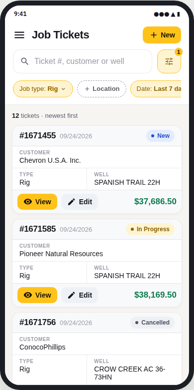
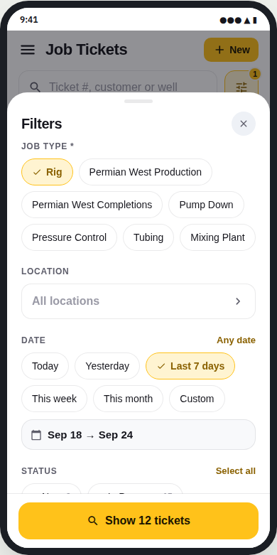
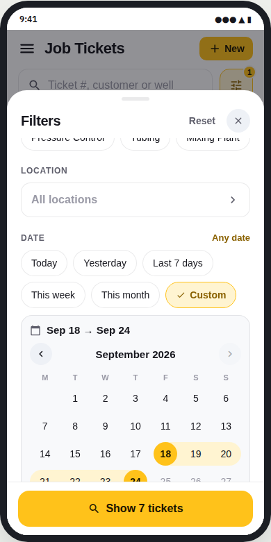
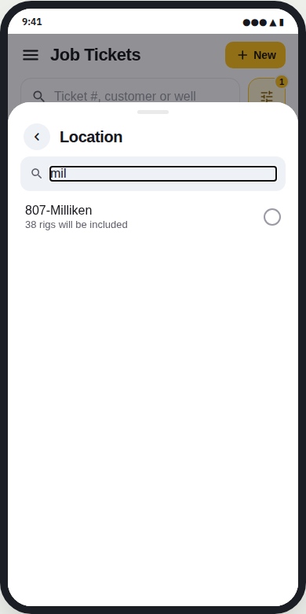

# react-native-search-filters

Search and filtering for record lists such as Job Tickets:
- **`SearchPanel`**: a slim collapsible *Search & Filters* bar. Collapsed, it shows a one-line summary of what's applied and a count badge. It expands to reveal the search field and chips.
- **`SearchBar`**: an always-visible search field with a Filters button that shows how many filters are active.
- **`FilterChips`**: a row of chips showing the applied filters.
- **`FilterSheet`**: a bottom sheet for editing every filter, with a live result count.

It's built in the same yellow theme as [`react-native-record-card`](../react-native-record-card), [`react-native-app-nav`](../react-native-app-nav) and [`react-native-send-queue`](../react-native-send-queue).

| Search and chips | Filter sheet | Custom date range | Searchable location |
|---|---|---|---|
|  |  |  |  |

Pure React Native (`Animated`, `PanResponder`, `Modal`). No Expo, no Reanimated, no date-picker library and no icon font.

## What it does

| | |
|---|---|
| **Collapsible panel** | `SearchPanel` keeps the header to one slim bar that still says what's applied: *Search & Filters · Rig · 807-Milliken · Last 7 days · 2 statuses* (or *Ticket #16717*). Tap to open the search and chips. Pass `expanded`/`onExpandedChange` to fold it when the list scrolls. |
| **Search first** | The search field is always on screen. It filters as you type, and suits ticket numbers, customers and wells alike. |
| **Applied filters are visible** | Chips under the search show every applied filter in full, e.g. *Permian West Production*, *807-Milliken*, *Last 7 days*, *2 statuses*. The row stays one line tall: as many chips as fit, then a *+2* chip that expands the rest in place, and *Less* folds them back. Tap a chip to change that filter; × removes it. Unused filters appear as dashed *+ Status* chips so they can be found. |
| **Active-filter badge** | The Filters button shows how many filters narrow the list. |
| **Chips for short lists** | Single-choice filters with up to 8 options (e.g. Job type) show as one-tap chips. Multi-choice filters (e.g. Status) are toggle chips that can show a colour dot and a count. |
| **Search for long lists** | Longer lists (e.g. Location) open a searchable page inside the sheet, with a hint per option such as *38 rigs will be included*. Tapping a list filter's chip opens this page directly, and picking an option applies it straight away. |
| **Dates without typing** | Presets (Today, Yesterday, Last 7 days, This week, This month) or Custom, which opens a range calendar: tap the start date, then the end date. Future days are disabled. |
| **Built for server-side search** | The sheet edits a draft and sends nothing until you press **Search tickets**, so each search is one request. If your API has a count endpoint, return a Promise from `resultCount` and the button reads *Show 23 tickets* (debounced, with stale answers ignored); otherwise leave it out. |
| **Ticket number or filters** | Pass `paused` to `FilterChips` while a ticket number is typed: the chips collapse into a *Filters paused* pill with a *Use filters* link, making it clear the number search ignores filters. |
| **Draft editing** | The sheet edits a copy. Nothing changes until you press the button, and Reset goes back to the defaults. |

Filters are described as data:

```ts
const FILTERS: FilterDef[] = [
  { key: 'jobType', label: 'Job type', type: 'single', required: true, defaultValue: 'rig', options: [...] },
  { key: 'location', label: 'Location', type: 'single', anyLabel: 'All locations', options: [{ value: '807', label: '807-Milliken', hint: '38 rigs will be included' }, ...] },
  { key: 'date', label: 'Date', type: 'dateRange', defaultValue: { preset: 'last7', from: null, to: null } },
  { key: 'status', label: 'Status', type: 'multi', noun: ['status', 'statuses'], options: [{ value: 'new', label: 'New', tone: 'info' }, ...] },
];
```

## Usage

```tsx
const [query, setQuery] = useState('');
const [values, setValues] = useState(defaultsOf(FILTERS));
const [sheet, setSheet] = useState(false);
const [focusKey, setFocusKey] = useState<string | null>(null);
const open = (key: string | null) => { setFocusKey(key); setSheet(true); };

<SearchPanel
  expanded={panelOpen}
  onExpandedChange={setPanelOpen}
  summary={query ? `Ticket #${query}` : summarizeFilters(FILTERS, values)}
  badge={query ? 0 : countActive(FILTERS, values)}
>
<SearchBar
  value={query}
  onChangeText={setQuery}
  placeholder="Ticket #, customer or well"
  filterCount={countActive(FILTERS, values)}
  onPressFilters={() => open(null)}
/>
<FilterChips
  filters={FILTERS}
  value={values}
  onPressChip={open}
  onRemove={key => setValues(v => ({ ...v, [key]: clearedOf(FILTERS.find(f => f.key === key)!) }))}
/>
</SearchPanel>

<FlatList onScrollBeginDrag={() => setPanelOpen(false)} … />

<FilterSheet
  visible={sheet}
  onClose={() => setSheet(false)}
  filters={FILTERS}
  value={values}
  onApply={setValues}
  // Optional: only if your API can count. Otherwise the button says “Search tickets”.
  resultCount={draft => api.countTickets(draft)}
  noun={['ticket', 'tickets']}
  focusKey={focusKey}
  bottomInset={insets.bottom}
/>
```

To turn a date value into concrete dates for your query, use `resolveRange(values.date, DEFAULT_PRESETS, new Date())`. It returns ISO dates (`YYYY-MM-DD`).

All three components take `renderIcon={(name, color, size) => …}` for your icon set. The names are `search`, `filter`, `close`, `check`, `chevron`, `back`, `down`, `calendar` and `add`. Without it they fall back to plain glyphs.

## API

- **`SearchPanel`**: `children` (e.g. `SearchBar` and `FilterChips`), `summary?` (use `summarizeFilters(filters, values)`), `badge?`, `title?`, `expanded?`, `onExpandedChange?`, `defaultExpanded?`, `renderIcon?`, `theme?`, `style?`.
- **`SearchBar`**: `value`, `onChangeText`, `onSubmit?`, `placeholder?`, `filterCount?`, `onPressFilters?`, `loading?`, `keyboardType?`, `renderIcon?`, `theme?`, `style?`.
- **`FilterChips`**: `filters`, `value`, `onPressChip`, `onRemove`, `onClearAll?`, `showInactive?` (default true), `layout?` (`'collapse'` default: one line plus a `+N` chip that expands in place; `'wrap'`: every chip over as many lines as needed; `'scroll'`: one sideways-scrolling line), `showLabels?` (prefix values with the filter name; off by default), `paused?`, `pausedNote?`, `onResume?`, `resumeLabel?`, `renderIcon?`, `theme?`, `style?`.
- **`FilterSheet`**: `visible`, `onClose`, `filters`, `value`, `onApply`, `resultCount?` (number or Promise), `noun?`, `applyLabel?`, `focusKey?`, `title?`, `today?`, `renderIcon?`, `bottomInset?`, `maxWidth?` (600), `theme?`.
- **Helpers**:
  - `defaultsOf(filters)`: default values for every filter.
  - `clearedOf(filter)`: the "no filter" value for one filter.
  - `countActive(filters, values)`: how many filters narrow the results.
  - `isActive`, `summarize` (a filter's chip text), `resolveRange`, `DEFAULT_PRESETS`.
- **Filter types**:
  - `single`: `options`, `required?`, `defaultValue?`, `anyLabel?`, `display?` (`'chips' | 'list'`).
  - `multi`: `options` (each option can have `tone` and `count`), `noun?`, `defaultValue?`.
  - `dateRange`: `presets?`, `defaultValue?`.

## Run the demo on a phone

```sh
./scripts/create-demo-app.sh            # creates ../SearchFiltersDemo (bare React Native, no Expo)
cd ../SearchFiltersDemo
npx react-native run-android
```

## Development

```sh
npm install
npm run typecheck
```
