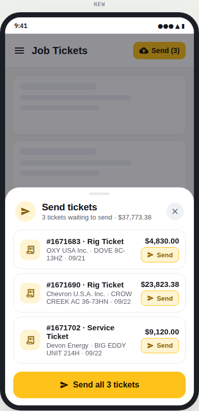
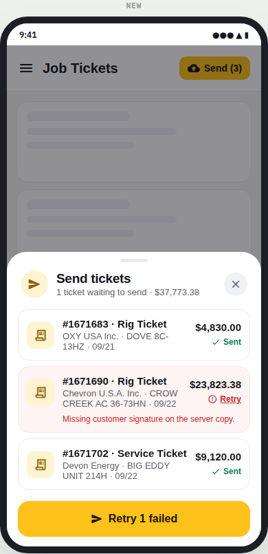
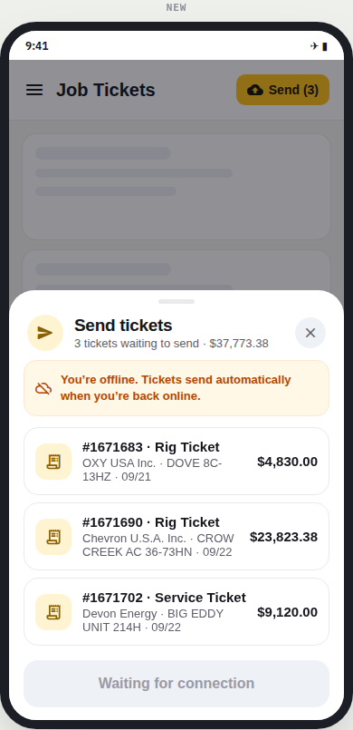

# react-native-send-queue

A bottom sheet for sending records saved on the device (tickets, orders, reports) to the server. It's built in the same style and yellow theme as [`react-native-record-card`](../react-native-record-card) and [`react-native-app-nav`](../react-native-app-nav).

| Send one or all | Failed ticket | Offline |
|---|---|---|
|  |  |  |

Pure React Native (`Animated`, `PanResponder`, `Modal`). No Expo, no Reanimated, no native modules and no icon font.

## What it does

`SendQueueSheet` sends records saved on the device, one at a time from a row's small **Send** button or all at once with the main button. Each row shows Sending, ✓ Sent, or a red error with its own Retry. The single solid-yellow button always says what it does: *Send ticket*, *Send all 3 tickets*, *Retry 1 failed*, then *Done*; row buttons are soft yellow so the main action stays obvious. With one ticket there are no row buttons. Offline, sending is disabled and a banner explains that tickets send when the connection is back. When everything is sent the header turns green and the sheet closes itself.

It works on tablets too: there the sheet floats centred at 560 px wide instead of stretching across the screen. It follows the system light/dark setting.

## Usage

```tsx
import { SendQueueSheet } from './react-native-send-queue/src';
```

```tsx
<SendQueueSheet
  visible={open}
  onClose={() => setOpen(false)}
  items={queue.map(t => ({
    id: t.id,
    title: `#${t.id} · ${t.type}`,
    subtitle: `${t.customer} · ${t.well} · ${t.date}`,
    amount: money(t.amount),
  }))}
  send={id => api.sendTicket(id)}          // resolve = sent, reject(new Error(msg)) = failed
  online={isOnline}
  total={money(queueTotal)}
  onDone={({ sent }) => removeFromQueue(sent)}
  renderIcon={(name, color, size) => <Icon name={ICONS[name]} color={color} size={size} />}
  bottomInset={insets.bottom}
/>
```

`send` is your API call for one ticket. Resolve when the server accepts it; reject with an `Error` to show its message on the row. Items are sent one after another.

## Props

Props: `visible`, `onClose`, `items` (`{ id, title, subtitle?, amount? }`), `send`, `online?` (true), `title?` ('Send tickets'), `noun?` (`['ticket', 'tickets']`), `total?`, `onDone?`, `autoCloseMs?` (1400; 0 keeps it open), `renderIcon?` (names: `ticket`, `send`, `check`, `error`, `offline`, `close`, `done`), `bottomInset?`, `maxWidth?` (560), `theme?`.

## Run the demo on a phone

```sh
./scripts/create-demo-app.sh            # creates ../SendQueueDemo (bare React Native, no Expo)
cd ../SendQueueDemo
npx react-native run-android
```

The demo has three tickets. The second fails once so you can see Retry, and a switch lets you try the offline state.

## Development

```sh
npm install
npm run typecheck
```
